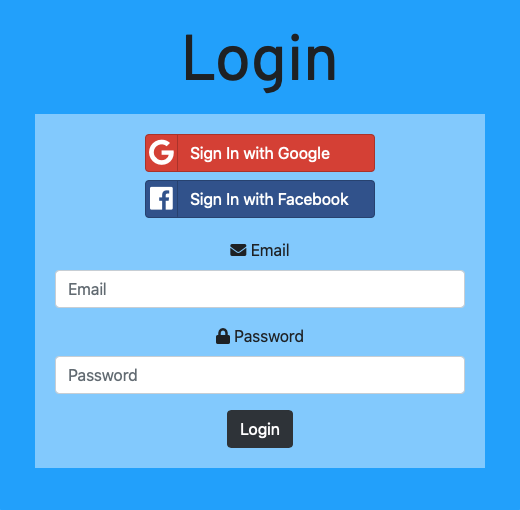
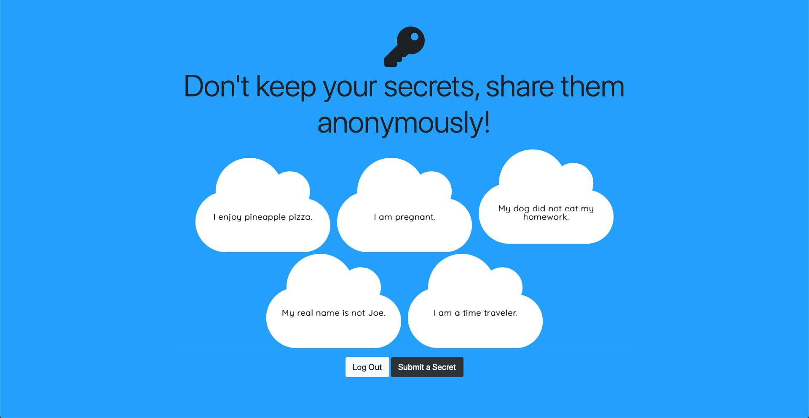
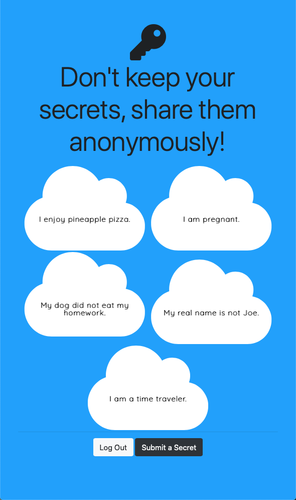

  Secrets

<h3 align="center"
  A platform where users can anonymously read and post secrets on a public forum. 
  Allows users to securely register/login with email/pw or Google/Facebook to post anonymous secrets.  
  Login information encrypted, hashed, salted, and saved locally with cookies using Passport.js, bcrypt, MD5  
</h3>
<h1></h1>
<h3 align="center">Landing Page</h3>

  

<h3 align="center">Register or Login</h3>

  
  

<h3 align="center">Home page</h3>

  

<h3 align="center">Submit a Secret</h3>

  

<h3 align="center">Responsive</h3>

  

